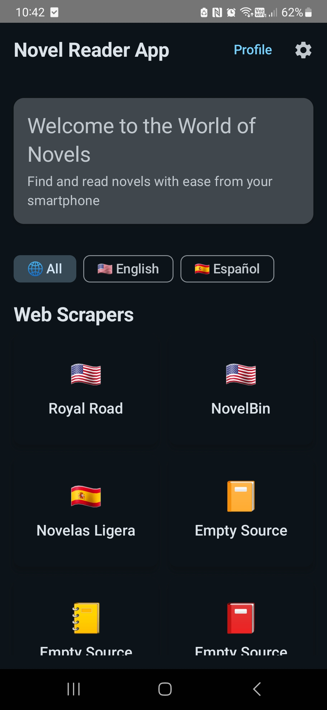
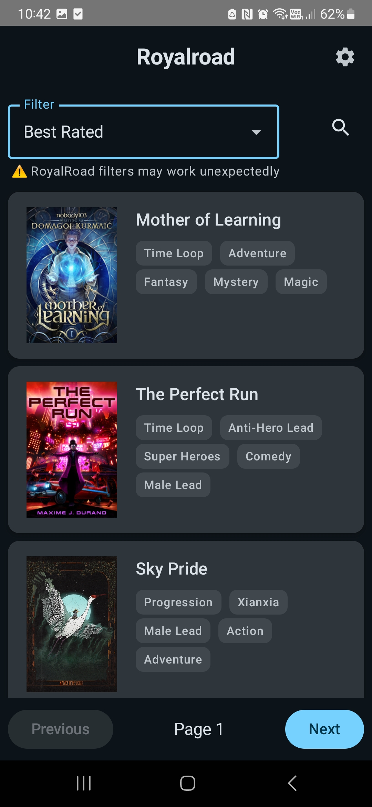
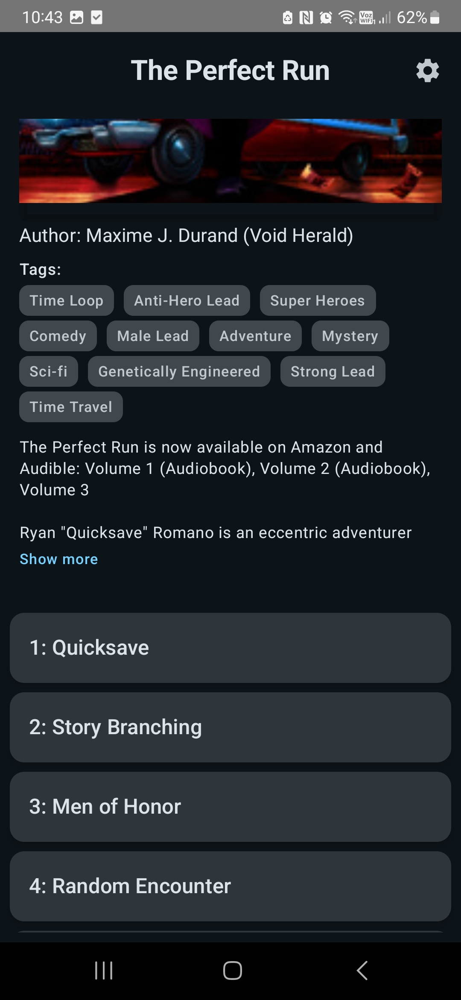
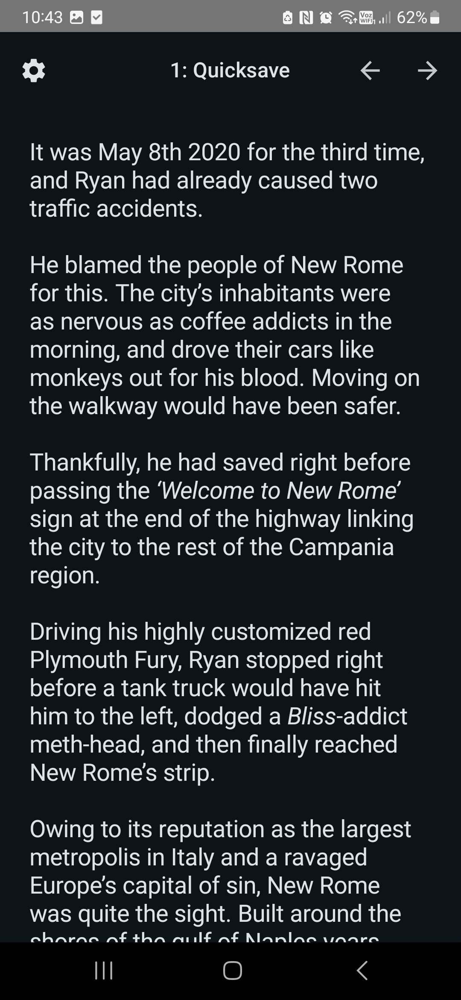
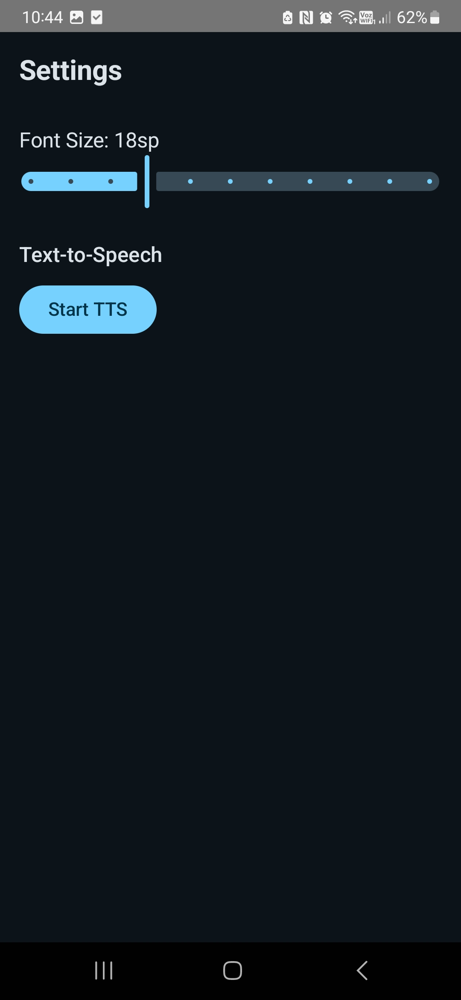
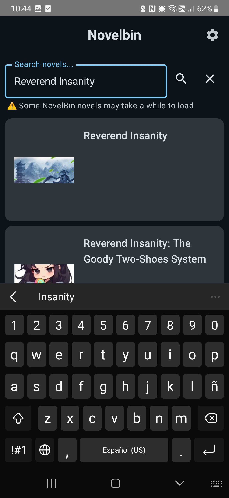

# NovelReaderApp

Small personal project to read web novels on Android. Built in **Android Studio** with Jetpack Compose.

### Inspirations

* [Bernso](https://github.com/Bernso/Bernso)
* [NovelReaderWeb](https://bernso.pythonanywhere.com)
* [AkashicRecords](https://github.com/Luiz-eduardp/akashic_records)

### Current Scrapers

* **RoyalRoad** – latest, best/popular, search, genre filter
* **NovelBin** – latest, best/popular, search, completed novels filter
* **NovelasLigera** - main, chinese, korean, japanese pages

### Current State

* Only scraping **RoyalRoad** + **NovelBin** + **NovelasLigera**
* Basic TTS and font size support
* Added backend integration (not yet connected to scrapers)

### User Flow

1. Open app → see sources (RoyalRoad, NovelBin)
2. Pick a source → browse latest / best / search / filters
3. Open a novel → view title, description, chapters
4. Read chapter → adjust font size or start TTS

### Screenshots

#### Home / Sources

#### Novels List

#### Novel Details

#### Chapter View

#### Settings / TTS

#### Search Novel

